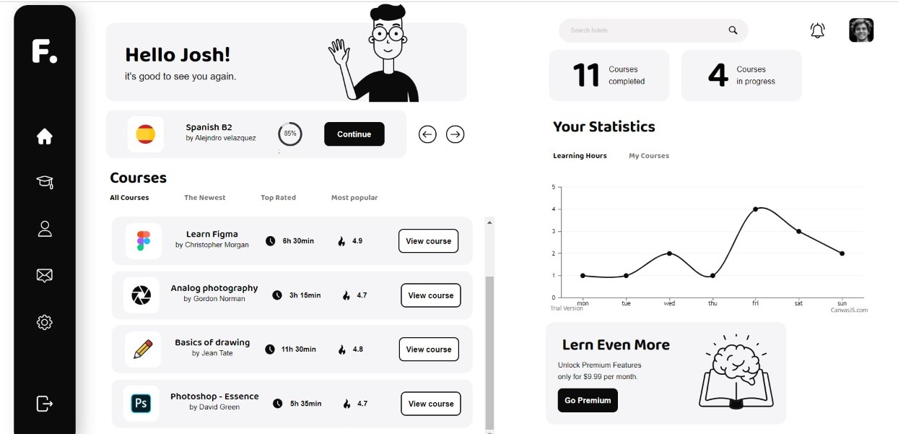
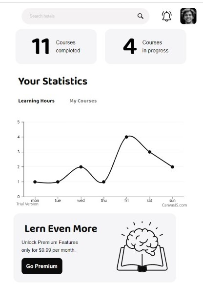
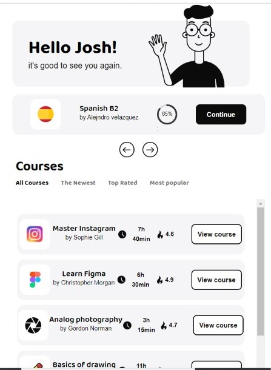

# Clickk Assignment 🚀

**The mobile view starts with the search section**

**The Courses section Are kept beside as apps look generally**

## Welcome! 👋

Thanks for checking out my repository.

**This is to explain what all I have done in the assignment so far**

## All about this project

1. I have created the react App in such a way that it can be easily used in production as each component is defined separately along with the props declarations.
2. Sections Containing Components that can grow in future like Courses are made scrollable so that infinite no of childrens can be added.
3. I have used npm package called "react-circular-progressbar" for implimenting circular avatar.
4. Graph in the project is created by using canvasJs npm package and is optimised by me so that it looks same as that of graph in the project.
5. While making it a PWA I have flipped the page orientation to give it a real look of an app.
6. I have optimised it for 572px that is the standard phone size so that PWA can be checked.

